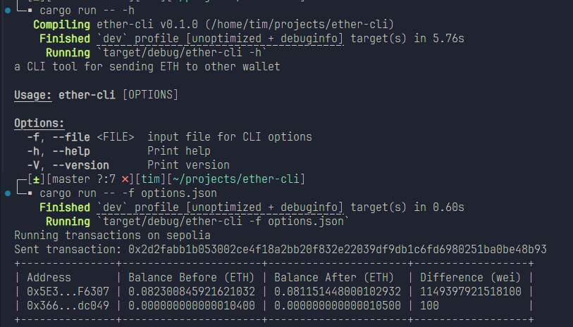

<p align="center">
  
</p>

## Ether CLI
A CLI tool for sending ETH to other wallet.

### Prerequisites

Please create a `.env` file in the root directory of the project with the following content:

```
SEPOLIA_RPC_URL=""
MAINNET_RPC_URL=""
```

The RPC url can be obtained from RPC provider
- [ChainList](https://chainlist.org/chain/11155111)
- [Alchemy](https://www.alchemy.com/)
- [Infura](https://infura.io/)

### Usage

```bash
ether-cli -f options.json
```

### Transaction Details

The CLI will display the transaction hash, you can obtain more information from the block explorer of each chain.

Example
- [Sepolia - 0x2d2fabb1b053002ce4f18a2bb20f832e22039df9db1c6fd6980251ba0be48b93](https://sepolia.etherscan.io/tx/0x2d2fabb1b053002ce4f18a2bb20f832e22039df9db1c6fd6980251ba0be48b93)

### CLI Options Schema

The CLI options schema is defined in `schema/cli-schema.json`.

sample option json file

```
{
    "$schema": "./schema/cli-schema.json",
    "wallet_private_key": "",
    "amount_wei": 100,
    "chain_id": "sepolia",
    "to_address": ""
}
```

